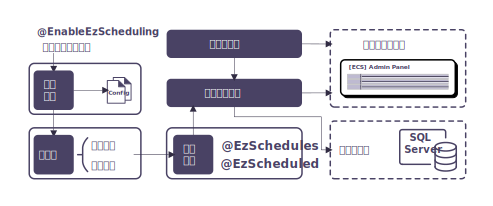
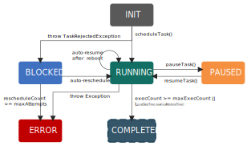

<h1 align="center" style="margin: 30px 0 30px; font-weight: bold;">Easy Cron Scheduler</h1>
<h4 align="center">基于Spring的自研定时任务组件</h4>
<p align="center">
	<a href="https://github.com/comradexy/mw-ecs"></a>
	<a href="https://github.com/comradexy/mw-ecs/LICENSE"></a></p>


## 一、需求背景

> [@Scheduled，Quartz，XXL-JOB三种定时任务总结](https://blog.csdn.net/m0_72075879/article/details/134794515)

Schedule是计划执行任务的通用术语。Quartz是Java任务调度框架，支持灵活任务管理。XXL-JOB是分布式任务调度平台，注重大规模系统，提供分布式任务调度和管理，包括动态调度、监控、日志记录等功能。选择取决于应用需求，Quartz适用于Java应用，XXL-JOB适用于分布式环境。

- `@Scheduled` 简单易用，但不支持持久化；
- `quartz` 支持任务持久化，但需要复杂的配置；
- `xxl-job` 功能丰富，适用于分布式场景，但是对于简单场景来说，又显得过于庞大冗余。

本项目基于`org.springframework.scheduling` 包实现一个简单易用的定时任务管理中心，便于动态创建、停止定时任务。作为扩展功能，支持任务持久化，实现任务的暂定和恢复功能，添加新任务时计算其与已有任务的相似度，提供相似任务提醒。


## 二、方案设计


<div align=center>
     
	<p>图1. 系统架构</p>
</div>

使用者通过在启动类上注明 `@EnableEzScheduling` ，来开启组件服务；在方法上注明 `@EzScheduled` （本项目支持重复注解，如果需要为同一个方法设置不同的定时周期/最大执行次数/终止时间，可以用 `@EzSchedules` 包裹多个 `@EzScheduled` 注解），并将该方法的宿主类声明为Spring Bean，以此完成定时任务的定义；

系统启动时，加载配置文件，并根据配置参数初始化系统环境，选择性开启外围服务（ `enableStorage=true`  时，开启持久化服务； `enableAdmin=true` 时，开启管理端服务）；

系统环境以及外围服务初始化完成后，通过实现 `BeanPostProcessor` 接口，扫描所有 `@EzScheduled` （包括被`@EzScheduled` 包裹的）修饰的方法，将其解析并存储在任务存储中心中；

最后，任务调度器从任务存储中心中读取所有初始化完成的任务，对其进行调度，开启定时任务。


## 三、技术实现

### 1. 工程结构

```
easy-cron-scheduler
└─src
    └─main
        ├─java
        │  └─cn
        │      └─comradexy
        │          └─middleware
        │              └─ecs
        │                  ├─annotation
        │                  │      EnableEzScheduling.java
        │                  │      EzScheduled.java
        │                  │      EzSchedules.java
        │                  │
        │                  ├─aspect
        │                  │      TaskHandlerAspect.java
        │                  │
        │                  ├─common
        │                  │      ScheduleContext.java
        │                  │      TaskKeyUtils.java
        │                  │
        │                  ├─config
        │                  │      EasyCronSchedulerConfiguration.java
        │                  │      EasyCronSchedulerProperties.java
        │                  │
        │                  ├─domain
        │                  │      ErrorMsg.java
        │                  │      ExecDetail.java
        │                  │      TaskHandler.java
        │                  │
        │                  ├─support
        │                  │  ├─admin
        │                  │  │  ├─config
        │                  │  │  │      AdminConfiguration.java
        │                  │  │  │      WebConfig.java
        │                  │  │  │
        │                  │  │  ├─controller
        │                  │  │  │      AdminController.java
        │                  │  │  │
        │                  │  │  ├─domain
        │                  │  │  │      ExecDetailDTO.java
        │                  │  │  │      Request.java
        │                  │  │  │      Result.java
        │                  │  │  │      TaskHandlerDTO.java
        │                  │  │  │
        │                  │  │  └─service
        │                  │  │          IScheduleService.java
        │                  │  │          ScheduleService.java
        │                  │  │
        │                  │  └─storage
        │                  │      │  IStorageService.java
        │                  │      │
        │                  │      ├─config
        │                  │      │      StorageConfiguration.java
        │                  │      │
        │                  │      ├─jdbc
        │                  │      │  │  JdbcStorageService.java
        │                  │      │  │
        │                  │      │  └─mapper
        │                  │      │          ErrorMsgMapper.java
        │                  │      │          ExecDetailMapper.java
        │                  │      │          TaskHandlerMapper.java
        │                  │      │
        │                  │      └─redis
        │                  │              RedisClientUtils.java
        │                  │              RedisStorageService.java
        │                  │
        │                  └─task
        │                          InitProcessor.java
        │                          ScheduledTask.java
        │                          Scheduler.java
        │                          SchedulingRunnable.java
        │                          TaskStore.java
        │
        └─resources
            ├─data
            │      schema.sql
            │
            ├─mapper
            │      ErrorMsgMapper.xml
            │      ExecDetailMapper.xml
            │      TaskHandlerMapper.xml
            │
            └─static
                    index.css
                    index.html
                    index.js
           
```


### 2. 初始化服务


### 3. 任务状态迁移


<div align=center>
     
	<p>图2. 任务状态流转图</p>
</div>

`ExecDetail` 共有6种状态，即 `INIT` 、 `RUNNING` 、 `PAUSED` 、 `BLOCKED` 、 `ERROR` 和 `COMPLETED` ，各个任务状态的迁移过程如图2所示。

被 `@EzScheduled` 修饰的方法会被注册为 `TaskHandler` ，根据注解中的参数（包括 `cron` 、 `desc (optional)` 、`endTime (optional)` 、 `maxExecCount (optional)` ）注册相应的 `ExecDetail` ，其初始状态为 `INIT` ，两者注册完成后被存入 `TaskStore` ；

随后由 `Scheduler` 调用 `scheduleTask()` 方法对状态为 `INIT` 的任务进行调度，若调度成功，任务状态转为 `RUNNING` ；若 `Scheduler` 中没有空闲的线程可以用于任务调度，则会触发 `TaskRejectedException` 错误，任务会被暂时标记为 `BLOCKED` 状态，随后系统会自动进行多次延迟重试，如果重新调度成功，任务状态转为 `RUNNING` ；如果超过最大重试次数，任务将被标记为 `ERROR` ，等待人工处理；

如果任务运行过程中发生异常报错，任务将会被自动终止，并被标记为 `ERROR` ；

控制台可以通过调用 `pauseTask()` 和 `resumeTask()` 对任务分别进行暂停和恢复操作；

如果开启了持久化存储服务 `enableStorage=true` ，系统关机或运行过程中发生故障（如断电等）后，重启时，系统会自动扫描已被调度任务（即状态被存储为 `RUNNING` 的任务），并将其恢复；

如果任务执行次数达到上限或超过了终止时间，则任务终止 -> `COMPLETED` ；事实上， `COMPLETED` 是虚拟状态，任务进入该状态就会被删除；此外，控制台可以通过调用 `deleteTask()` 删除其他任何状态的任务。


### 4. 并行任务注册


### 5. 可扩展AOP


## 四、测试验证

### 1. 工程结构

```
easy-cron-scheduler-test
└─src
    ├─main
    │  ├─java
    │  │  └─cn
    │  │      └─comradexy
    │  │          └─middleware
    │  │              │  Application.java
    │  │              │
    │  │              ├─config
    │  │              │      SchedulerConfig.java
    │  │              │
    │  │              └─job
    │  │                      ScheduledTask.java
    │  │
    │  └─resources
    │          application.yml
    │
    └─test
        └─java
            └─cn
                └─comradexy
                    └─middleware
                            AppTest.java
                            UnitTest.java

```


### 2. 配置

```yaml
spring:
  application:
    name: ecs-test

server:
  port: 8091

logging:
  level:
    root: info

comradexy:
  middleware:
    scheudle:
      schedulerServerId: easy-cron-scheduler-server
      schedulerServerName: 简易定时任务调度服务
      schedulerPoolSize: 8
      enableStorage: true
      enableAdmin: true
      storageType: jdbc
      dataSource:
        url: jdbc:mysql://localhost:3306/easy_cron_scheduler?useUnicode=true&characterEncoding=utf-8&useSSL=false
        username: root
        password: 1234

```


### 3. 测试用例

```java
@Component
public class ScheduledTask {
    private final Logger logger = LoggerFactory.getLogger(this.getClass());

    @EzSchedules({
            @EzScheduled(cron = "0/4 * * * * ?", desc = "每4秒执行一次"),
            @EzScheduled(cron = "0/2 * * * * ?", desc = "每2秒执行一次")
    })
    public void test1() {
        String currentTime = LocalDateTime.now().format(DateTimeFormatter.ofPattern("yyyy-MM-dd HH:mm:ss.SSS"));
        logger.info("{}: 定时任务执行", currentTime);
    }

    @EzScheduled(cron = "0/3 * * * * ?", desc = "每3秒执行一次")
    public void test2() {
        int a = 1 / 0;
    }
}
```


### 4. 测试结果

#### 4.1. 管理端页面


#### 4.2. 数据库

ecs_exec_detail：


ecs_task_handler：


ecs_error_msg：


 

## 参考资料

1. [通过源码理解Spring中@Scheduled的实现原理并且实现调度任务动态装载](https://www.cnblogs.com/throwable/p/12616945.html)
2. [Quartz如何处理任务的持久化？](https://blog.csdn.net/u012680662/article/details/136927337#:~:text=Quartz%E9%80%9A%E8%BF%87%E9%9B%86%E6%88%90%E6%95%B0%E6%8D%AE%E5%BA%93%E6%94%AF%E6%8C%81%E6%9D%A5%E5%AE%9E%E7%8E%B0%E4%BB%BB%E5%8A%A1%E7%9A%84%E6%8C%81%E4%B9%85%E5%8C%96%E3%80%82,%E5%85%B7%E4%BD%93%E6%9D%A5%E8%AF%B4%EF%BC%8CQuartz%E4%BD%BF%E7%94%A8JobStore%E6%9D%A5%E5%AD%98%E5%82%A8%E5%92%8C%E7%AE%A1%E7%90%86%E4%BB%BB%E5%8A%A1%E7%9A%84%E7%9B%B8%E5%85%B3%E4%BF%A1%E6%81%AF%EF%BC%8C%E5%8C%85%E6%8B%AC%E4%BB%BB%E5%8A%A1%E7%9A%84%E5%AE%9A%E4%B9%89%E3%80%81%E7%8A%B6%E6%80%81%E3%80%81%E8%A7%A6%E5%8F%91%E5%99%A8%E7%9A%84%E8%AE%BE%E7%BD%AE%E7%AD%89%E3%80%82%20%E9%80%9A%E8%BF%87%E5%B0%86%E8%BF%99%E4%BA%9B%E4%BF%A1%E6%81%AF%E5%AD%98%E5%82%A8%E5%9C%A8%E6%95%B0%E6%8D%AE%E5%BA%93%E4%B8%AD%EF%BC%8CQuartz%E8%83%BD%E5%A4%9F%E5%9C%A8%E7%B3%BB%E7%BB%9F%E9%87%8D%E5%90%AF%E6%88%96%E6%95%85%E9%9A%9C%E6%81%A2%E5%A4%8D%E5%90%8E%E9%87%8D%E6%96%B0%E5%8A%A0%E8%BD%BD%E4%BB%BB%E5%8A%A1%EF%BC%8C%E5%B9%B6%E7%A1%AE%E4%BF%9D%E4%BB%BB%E5%8A%A1%E8%83%BD%E5%A4%9F%E6%AD%A3%E7%A1%AE%E6%89%A7%E8%A1%8C%E3%80%82)
3. [定时任务框架Quartz](https://cloud.tencent.com/developer/article/1947192)
4. [深入理解Spring的@Order注解和Ordered接口](https://blog.csdn.net/zkc7441976/article/details/112548075)
5. [Spring IOC容器启动流程 AbstractApplicationContext#refresh()方法源码分析（一）](https://cloud.tencent.com/developer/article/1497793?from_column=20421&from=20421)
